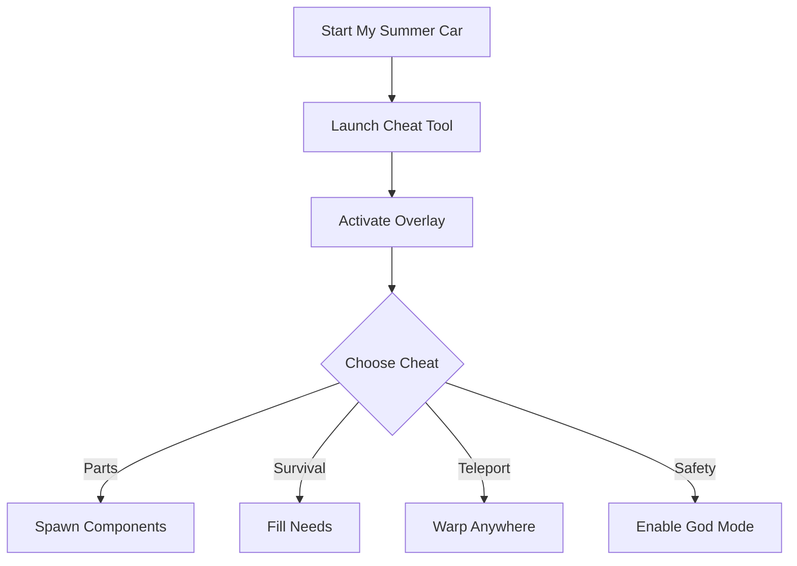

# 🚗 My Summer Car Cheat Tool

My Summer Car is known for its hardcore realism: assembling parts, managing hunger and thirst, and struggling to keep your car alive. But sometimes, you want to bypass the grind and focus on fun. That’s where the **My Summer Car Cheat Tool** comes in—giving you the power to spawn items, control survival stats, and fast-track your builds.

Whether you’re testing crazy engine setups or just avoiding permadeath frustration, this cheat tool transforms gameplay into a smoother, more creative sandbox.

---

## 🔎 Overview

With the cheat menu, you can:

* Instantly spawn car parts, tools, and consumables
* Manage hunger, thirst, fatigue, and dirtiness easily
* Teleport around the map for faster play
* Enable god mode for stress-free exploration
* Save time by skipping repetitive grinding

It’s designed for players who want **freedom, speed, and control** over their MSC experience.

---

## ⚙️ Key Features

* **🔧 Part Spawner** – Drop any engine or body component into the world instantly.
* **🍔 Survival Boosts** – Fill hunger, thirst, fatigue, and urine meters anytime.
* **🛰 Teleportation** – Jump to shops, home, or your car in seconds.
* **🛡 God Mode** – Disable death from crashes, starvation, or exhaustion.
* **💰 Infinite Money** – Stock up on beer and sausages endlessly.
* **🎛 Hotkey Customization** – Set your own bindings for maximum speed.

[!NOTE]
This cheat tool is fully **offline and client-based**, meaning safe to use without multiplayer risk.

---

## 🖥 Compatibility

| Platform       | Status | Notes                        |
| -------------- | ------ | ---------------------------- |
| Windows 10/11  | ✅      | Full compatibility           |
| Steam Version  | ✅      | Recommended                  |
| Pirated Copies | ⚠️     | May require manual file path |
| Linux/Proton   | ⚠️     | Experimental support         |
| Mac            | ❌      | Not supported                |

---

## ⚡ Setup Guide

1. Download and extract the cheat tool.
2. Launch **My Summer Car** normally.
3. Run `msc_cheat.exe` as Administrator.
4. Press `F2` to open the overlay.
5. Use the menu or hotkeys to activate cheats.

```bash
# Example quick run
msc_cheat.exe --overlay --godmode
```

---

## 📊 How It Works



---

## ❓ FAQ

**Q: Can cheats break my save file?**
A: No, all changes are reversible and save-safe.

**Q: Will this tool unlock all parts automatically?**
A: You can spawn any part without visiting the store.

**Q: Is money infinite?**
A: Yes, you can toggle unlimited funds anytime.

**Q: Does it support mods like MSC Mod Loader?**
A: Yes, it runs alongside most mods without conflict.

---

## 🚀 Final Thoughts

The **My Summer Car Cheat Tool** gives you freedom over survival stats, cars, and gameplay pace. Whether you want to roleplay, experiment, or just build crazy cars without grind—this is your ultimate sandbox companion.

---
